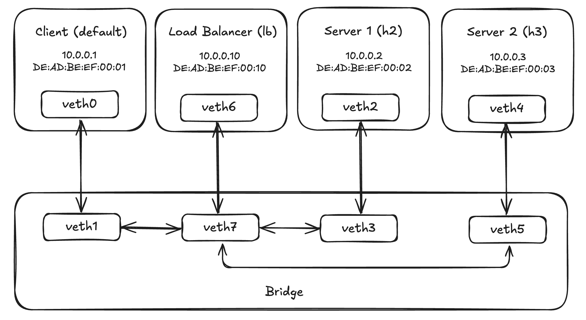

# Setting up the project

First, you'll need to compile `libbpf`:

```
git submodule update --init --remote --recursive
cd external/libbpf
OBJDIR=build DESTDIR=install-dir make -C src install
```

You can then compile the eBPF program loader and the load balancer with:

```
make all
```

In order to emulate different servers, we're going to manually setup the network
topology using a linux bridge and network namespaces:

```
make topology
```



You can teardown this topology by running `make teardown` or `make clean`. We
now need to load the eBPF program into the load balancer, which can be done
with:

```
sudo ip netns exec lb ./build/loader build/load_balancer.bpf.o xdp_lb veth6
```

It can be unloaded with:

```
sudo ip netns exec lb ip link set dev veth6 xdpgeneric off
```

We're now ready to test our load balancer. I recommend using tmux to split your
terminal into three different panes. On each of the servers, we're going to
start a netcat listener on port 8080 and try to connect to them from our client

To start the netcat listener on the first server, run:

```
sudo ip netns exec h2 nc -k -l 8080
```

To start the netcat listener on the second server (separate tmux pane), run:

```
sudo ip netns exec h3 nc -k -l 8080
```

And in the last tmux pane, run:

```
nc 10.0.0.10 8080
```

You can then type any message into the netcat client and see which listener
prints it out. If you restart the netcat client multiple times, you should be
able to see the output appearing each of the listeners on different runs. 